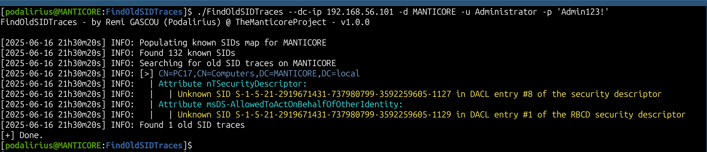

<p align="center">
    A cross-platform tool to find traces of old SIDs in Active Directory security descriptors.
    <br>
    <a href="https://github.com/TheManticoreProject/FindOldSIDTraces/actions/workflows/release.yaml" title="Build"></a>
    
     
    <a href="https://twitter.com/intent/follow?screen_name=podalirius_" title="Follow"></a>
    <a href="https://www.youtube.com/c/Podalirius_?sub_confirmation=1" title="Subscribe"></a>
    <br>
</p>


## Features

 - [x] Only requires a **low privileges domain user account**
 - [x] Searches for old SIDs in `nTSecurityDescriptor` and `msDS-AllowedToActOnBehalfOfOtherIdentity` attributes
 - [x] Validates SIDs against a comprehensive map of well-known SIDs and SIDs from the domain
 - [x] Supports both LDAP and LDAPS connections

## Demonstration

In order to find the old SIDs that might remain in the security descriptors and structures of the objects in the domain, you can use the following command:

```bash
./FindOldSIDTraces --dc-ip "<domain_controller_ip>" --domain "<domain>" --username "<username>" --password "<password>" 
```

You will get the following output:



## Usage

```              
$ ./FindOldSIDTraces -h
FindOldSIDTraces - by Remi GASCOU (Podalirius) @ TheManticoreProject - v1.0.0

Usage: FindOldSIDTraces --domain <string> --username <string> [--password <string>] [--hashes <string>] [--quiet] [--debug] [--no-colors] [--attribute <string>] [--output-file <string>] --dc-ip <string> [--ldap-port <tcp port>] [--use-ldaps]

  Authentication:
    -d, --domain <string>   Active Directory domain to authenticate to.
    -u, --username <string> User to authenticate as.
    -p, --password <string> Password to authenticate with. (default: "")
    -H, --hashes <string>   NT/LM hashes, format is LMhash:NThash. (default: "")

  Configuration:
    -q, --quiet                Show no information at all. (default: false)
    --debug                    Debug mode. (default: false)
    -nc, --no-colors           No colors mode. (default: false)
    -a, --attribute <string>   Output attribute. (default: "distinguishedName")
    -o, --output-file <string> Output file to write results to. (default: "")

  LDAP Connection Settings:
    -dc, --dc-ip <string>       IP Address of the domain controller or KDC (Key Distribution Center) for Kerberos. If omitted, it will use the domain part (FQDN) specified in the identity parameter.
    -lp, --ldap-port <tcp port> Port number to connect to LDAP server. (default: 389)
    -L, --use-ldaps             Use LDAPS instead of LDAP. (default: false)
```

## Contributing

Pull requests are welcome. Feel free to open an issue if you want to add other features.

## Credits
  - [Remi GASCOU (Podalirius)](https://github.com/p0dalirius) for the creation of the [FindOldSIDTraces](https://github.com/TheManticoreProject/FindOldSIDTraces).